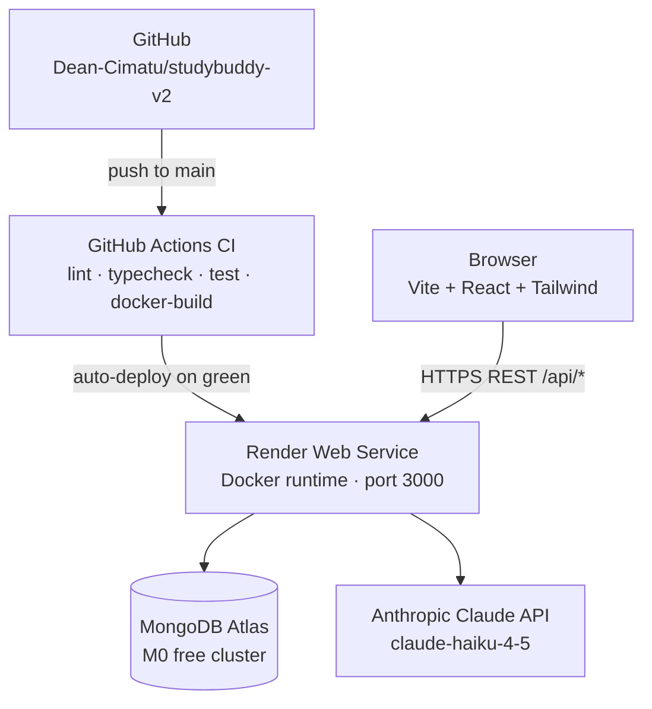

# 📚 StudyBuddy v2

[](https://github.com/Dean-Cimatu/studybuddy-v2/actions/workflows/ci.yml)
[](https://www.typescriptlang.org/)
[](https://react.dev/)
[](https://nodejs.org/)
[](https://www.docker.com/)
[](./LICENSE)

**Live demo → [studybuddy.deancimatu.com](https://studybuddy.deancimatu.com)**

AI-powered student productivity platform. Describe an assignment and it creates your task list. Mention you're stressed and it responds with warmth and Middlesex University support links. Built as a TypeScript monorepo and deployed to Render via Docker.

---

## Screenshots

### Dashboard — task list with AI sidebar


### AI chat — task generation mode


### AI chat — wellbeing mode with resource card


> Screenshots taken from the live deployment at [studybuddy.deancimatu.com](https://studybuddy.deancimatu.com)

---

## Origin

Originally built in 24 hours for a Middlesex University hackathon ([v1 repo](https://github.com/Dean-Cimatu/Hackathon)). The prototype worked but had real problems: JWT tokens in `localStorage`, no proper auth middleware, no tests, no CI, and a single JS file for the entire backend.

StudyBuddy v2 is a ground-up rebuild in 2026 — same idea, production-grade implementation. Proper auth with httpOnly cookies, per-user query scoping with explicit IDOR tests, a typed monorepo, GitHub Actions CI, Docker deployment, and a full security write-up.

---

## Tech stack

| Layer | Technology |
|---|---|
| Frontend | React 18 + Vite + TypeScript + Tailwind CSS |
| Backend | Express + TypeScript + Mongoose |
| Database | MongoDB Atlas (M0 free tier) |
| AI | Anthropic Claude Haiku 4.5 (`@anthropic-ai/sdk`) |
| Auth | JWT (httpOnly cookie) + bcrypt cost 12 |
| Server state | TanStack Query (React Query) |
| Testing | Vitest + Supertest + mongodb-memory-server |
| CI/CD | GitHub Actions → Render (Docker) |
| Containerisation | Docker multi-stage, `node:20-alpine`, non-root user |

---

## Architecture



See [`docs/ARCHITECTURE.md`](docs/ARCHITECTURE.md) for request flow diagrams and AI layer isolation detail.
See [`docs/SECURITY.md`](docs/SECURITY.md) for security decisions.

---

## Monorepo structure

```
studybuddy-v2/
├── client/          Vite + React + TypeScript + Tailwind
├── server/          Express + TypeScript API
├── shared/          Shared TypeScript types (no runtime code)
├── docs/            ARCHITECTURE.md, SECURITY.md
├── .github/
│   └── workflows/   ci.yml, keep-warm.yml
├── Dockerfile       Multi-stage build
├── render.yaml      Render Blueprint
└── docker-compose.yml
```

---

## Local setup

### Prerequisites
- Node 20 LTS (`nvm use`)
- MongoDB running (Atlas or Docker)
- Anthropic API key from [console.anthropic.com](https://console.anthropic.com)

### Install & run

```bash
npm install                         # installs all workspaces
cp server/.env.example server/.env  # fill in your values
npm run dev                         # client :5173, server :3000
```

### Environment variables

| Variable | Required | Description |
|---|---|---|
| `MONGODB_URI` | Yes | Atlas: `mongodb+srv://...` or Docker: `mongodb://mongo:27017/studybuddy-v2` |
| `JWT_SECRET` | Yes | `openssl rand -hex 32` |
| `ANTHROPIC_API_KEY` | Yes | From [console.anthropic.com](https://console.anthropic.com) |
| `PORT` | No | Server port (default 3000) |

### Run with Docker

```bash
docker compose up --build   # starts app + MongoDB on port 3000
```

---

## Deployment

The app deploys to **Render** via Docker. A `render.yaml` Blueprint is included.

### Steps

**1. MongoDB Atlas M0 cluster**
- [cloud.mongodb.com](https://cloud.mongodb.com) → New Project → M0 free
- Create DB user, whitelist `0.0.0.0/0`, copy connection string

**2. Render — New → Blueprint**
- Connect your fork; Render reads `render.yaml` automatically
- Set these env vars in the Render dashboard (marked `sync: false`):

| Variable | Source |
|---|---|
| `MONGODB_URI` | Atlas connection string |
| `JWT_SECRET` | `openssl rand -hex 32` |
| `ANTHROPIC_API_KEY` | Anthropic console |

**3. Custom domain**
- Render dashboard → your service → Settings → Custom Domains → add `studybuddy.deancimatu.com`
- At your DNS provider add: `CNAME studybuddy → <your-service>.onrender.com`
- Render provisions a TLS certificate automatically

**4. Branch protection (recommended)**
- GitHub → Settings → Branches → Add rule → `main`
- Enable: "Require status checks to pass" → select `lint`, `typecheck`, `test`
- Enable: "Require a pull request before merging"

**5. Keep-warm repo secret**
- GitHub → Settings → Secrets → Actions → `DEPLOYED_URL` = `https://studybuddy.deancimatu.com`
- The keep-warm workflow pings `/api/health` every 10 minutes to prevent Render free-tier spin-down

### Free tier cold starts

Render free tier spins down after 15 minutes of inactivity (~30–60s cold start). The keep-warm cron prevents this by pinging every 10 minutes. Upgrade to Render Starter ($7/mo) to eliminate cold starts entirely.

---

## Scripts

| Command | Description |
|---|---|
| `npm run dev` | Client + server concurrently |
| `npm run build` | Build all workspaces (shared → server → client) |
| `npm run lint` | ESLint across all workspaces |
| `npm run typecheck` | TypeScript checks across all workspaces |
| `npm run test` | Vitest across all workspaces (41 tests) |

---

## Roadmap

### Completed
- [x] Monorepo scaffold — TypeScript, Vite, Express, Tailwind
- [x] Docker multi-stage build + docker-compose
- [x] GitHub Actions CI — lint, typecheck, test, docker-build
- [x] MongoDB + Mongoose User model
- [x] Email/password auth — bcrypt + JWT httpOnly cookie
- [x] Tasks CRUD API with per-user scoping + IDOR tests
- [x] Dashboard UI with React Query + optimistic updates
- [x] Claude AI — task generation + wellbeing chat
- [x] Chatbot sidebar — collapsible, localStorage history, resource cards
- [x] Render deployment + keep-warm cron
- [x] Custom domain + TLS

### Planned
- [ ] Flashcard generation (AI-powered from notes)
- [ ] Pomodoro / study session timer
- [ ] Video/audio summarisation (OpenAI Whisper)
- [ ] Spaced repetition review scheduler
- [ ] Progress analytics dashboard
- [ ] Gamification — streaks, points, achievements

---

## License

[MIT](./LICENSE) © 2026 Dean Cimatu
