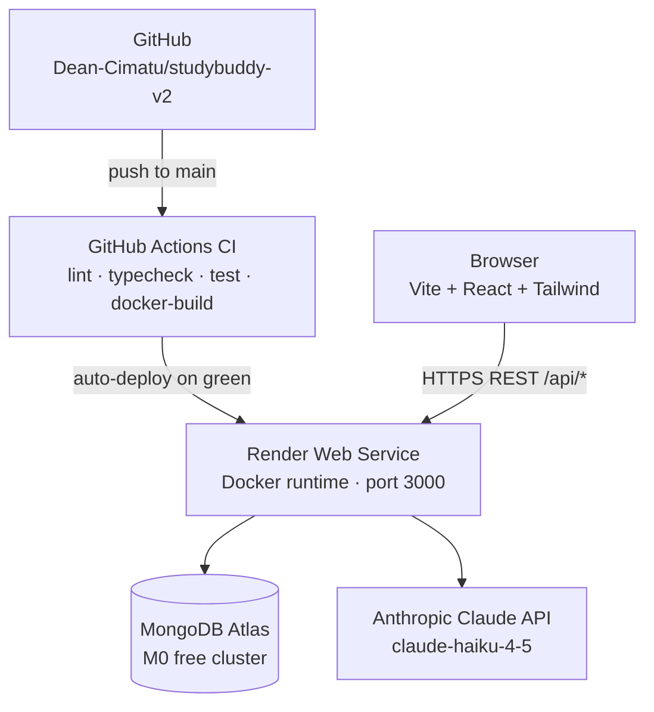

# 📚 StudyBuddy v2

[](https://github.com/Dean-Cimatu/studybuddy-v2/actions/workflows/ci.yml)

StudyBuddy v2 is an AI-powered student productivity platform built as a TypeScript monorepo. It combines intelligent task management, a Claude-backed chat assistant, flashcard generation, video summarisation, and gamification into a single cohesive study companion — rebuilt from the ground up with a production-grade stack targeting Render + MongoDB Atlas with GitHub Actions CI/CD.

---

## Architecture



---

## Monorepo Structure

```
studybuddy-v2/
├── client/          Vite + React + TypeScript + Tailwind
├── server/          Express + TypeScript API
├── shared/          Shared TypeScript types
├── tsconfig.base.json
├── eslint.config.mjs
└── .prettierrc
```

---

## Local Setup

### Prerequisites
- Node 20 LTS (`nvm use`)
- MongoDB Atlas account (or local MongoDB)
- Anthropic API key
- OpenAI API key (for video transcription)

### Install

```bash
npm install          # installs all workspaces from root
```

### Environment

Copy and fill in:

```bash
cp server/.env.example server/.env
```

### Run

```bash
# Both client and server (from root)
npm run dev

# Individually
npm run dev -w server   # http://localhost:3000
npm run dev -w client   # http://localhost:5173
```

---

## Environment Variables

| Variable | Required | Description |
|---|---|---|
| `MONGODB_URI` | Yes | MongoDB connection string (Atlas or local Docker) |
| `JWT_SECRET` | Yes | Long random string for JWT signing |
| `ANTHROPIC_API_KEY` | Yes | Anthropic Claude API key |
| `OPEN_AI_KEY` | For video | OpenAI key for audio transcription |
| `PORT` | No | Server port (default: 3000) |

---

## Running locally with Docker

### Prerequisites
- [Docker Desktop](https://www.docker.com/products/docker-desktop/) installed and running

### Build and run the full stack

```bash
# Copy and fill in env vars (MONGO_URI can point to the compose mongo service)
cp server/.env.example server/.env

# Build image and start app + mongo
docker compose up --build
```

The app will be available at `http://localhost:3000`. `/api/health` confirms the server is up.

### Build and run the app image standalone

```bash
docker build -t studybuddy-v2 .
docker run -p 3000:3000 --env-file server/.env studybuddy-v2
```

### Useful commands

```bash
docker compose down          # stop and remove containers
docker compose down -v       # also remove the mongo data volume
docker compose logs -f app   # stream app logs
```

---

## Deployment

The app deploys to **Render** (Docker runtime) backed by **MongoDB Atlas**. A `render.yaml` Blueprint is included for one-click setup.

### Step-by-step

**1. Fork / clone the repo**
```bash
git clone https://github.com/Dean-Cimatu/studybuddy-v2.git
cd studybuddy-v2
```

**2. Create a MongoDB Atlas M0 cluster**
- Go to [cloud.mongodb.com](https://cloud.mongodb.com) → New Project → Build a Cluster → M0 (free)
- Create a database user and note the password
- Allow connections from `0.0.0.0/0` (Network Access → Add IP)
- Copy the connection string: `mongodb+srv://<user>:<password>@cluster.mongodb.net/studybuddy-v2`

**3. Create a Render account and connect GitHub**
- Go to [render.com](https://render.com) → New → Blueprint
- Point it at your fork; Render reads `render.yaml` automatically

**4. Set environment variables in the Render dashboard**

These are declared with `sync: false` in `render.yaml` — set them manually in Render → Environment:

| Variable | Where to get it |
|---|---|
| `MONGODB_URI` | Atlas connection string from step 2 |
| `JWT_SECRET` | `openssl rand -hex 32` |
| `ANTHROPIC_API_KEY` | [console.anthropic.com](https://console.anthropic.com) → API Keys |

**5. Add `DEPLOYED_URL` repo secret (for keep-warm cron)**
- GitHub → Settings → Secrets → Actions → New secret
- Name: `DEPLOYED_URL`, Value: your Render service URL (e.g. `https://studybuddy-v2.onrender.com`)

**6. Push to main — CI runs, then Render auto-deploys**
```bash
git push origin main
```

### Free tier cold starts

Render's free tier spins down services after ~15 minutes of inactivity, causing a ~30–60 second cold start on the next request. The keep-warm workflow (`.github/workflows/keep-warm.yml`) pings `/api/health` every 10 minutes to prevent this.

> **Note:** GitHub Actions free tier provides 2,000 minutes/month. Pinging every 10 min = ~4,320 pings/month. Keep an eye on usage or switch to a paid Render plan to eliminate cold starts entirely.

---

## Scripts

| Command | Description |
|---|---|
| `npm run dev` | Run client + server concurrently |
| `npm run build` | Build all workspaces |
| `npm run lint` | ESLint across all workspaces |
| `npm run typecheck` | TypeScript checks across all workspaces |
| `npm run test` | Run tests across all workspaces |
