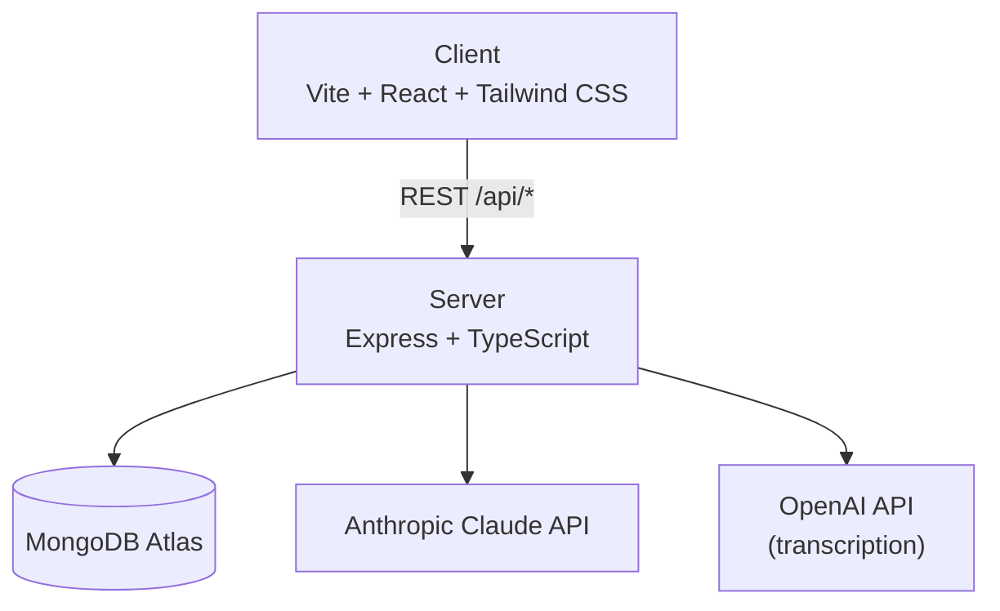

# 📚 StudyBuddy v2

StudyBuddy v2 is an AI-powered student productivity platform built as a TypeScript monorepo. It combines intelligent task management, a Claude-backed chat assistant, flashcard generation, video summarisation, and gamification into a single cohesive study companion — rebuilt from the ground up with a production-grade stack targeting Render + MongoDB Atlas with GitHub Actions CI/CD.

---

## Architecture



---

## Monorepo Structure

```
studybuddy-v2/
├── client/          Vite + React + TypeScript + Tailwind
├── server/          Express + TypeScript API
├── shared/          Shared TypeScript types
├── tsconfig.base.json
├── eslint.config.mjs
└── .prettierrc
```

---

## Local Setup

### Prerequisites
- Node 20 LTS (`nvm use`)
- MongoDB Atlas account (or local MongoDB)
- Anthropic API key
- OpenAI API key (for video transcription)

### Install

```bash
npm install          # installs all workspaces from root
```

### Environment

Copy and fill in:

```bash
cp server/.env.example server/.env
```

### Run

```bash
# Both client and server (from root)
npm run dev

# Individually
npm run dev -w server   # http://localhost:3000
npm run dev -w client   # http://localhost:5173
```

---

## Environment Variables

| Variable | Required | Description |
|---|---|---|
| `MONGO_URI` | Yes | MongoDB Atlas connection string |
| `JWT_SECRET` | Yes | Long random string for JWT signing |
| `ANTHROPIC_API_KEY` | Yes | Anthropic Claude API key |
| `OPEN_AI_KEY` | For video | OpenAI key for audio transcription |
| `PORT` | No | Server port (default: 3000) |

---

## Deployment

> _Deployment section — to be completed once Render + GitHub Actions CI/CD is configured._

- **Frontend:** Render static site, built from `client/`
- **Backend:** Render web service, built from `server/`
- **Database:** MongoDB Atlas (free tier)
- **CI/CD:** GitHub Actions — lint → typecheck → build on every push to `main`

---

## Scripts

| Command | Description |
|---|---|
| `npm run dev` | Run client + server concurrently |
| `npm run build` | Build all workspaces |
| `npm run lint` | ESLint across all workspaces |
| `npm run typecheck` | TypeScript checks across all workspaces |
| `npm run test` | Run tests across all workspaces |
