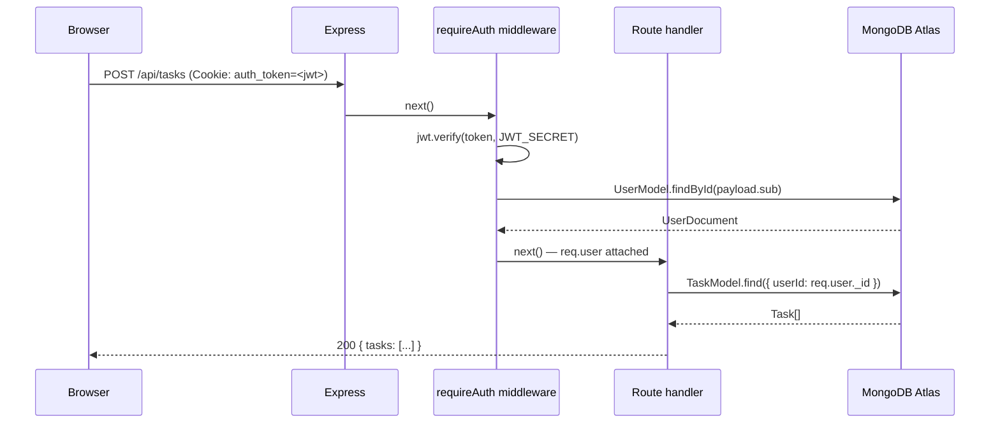
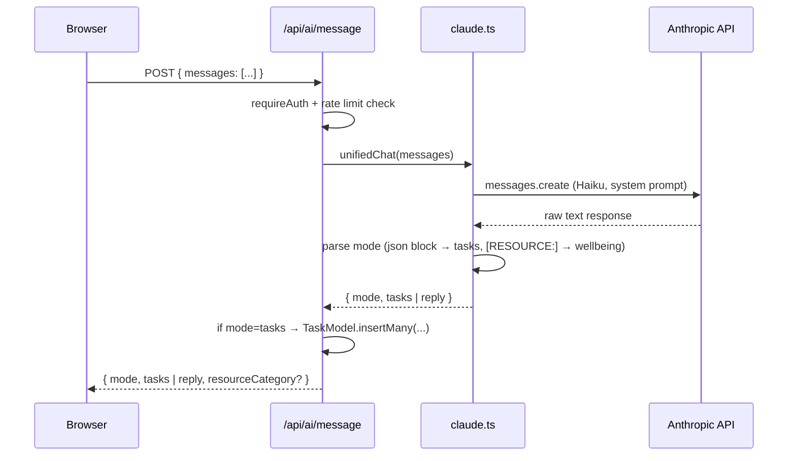
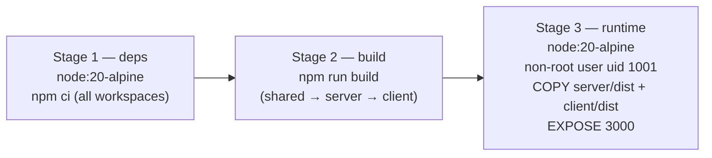
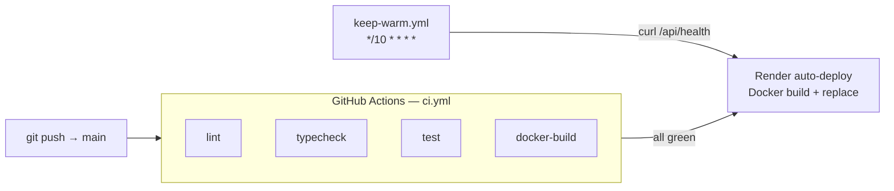

# Architecture

## Monorepo layout

```
studybuddy-v2/
├── client/          Vite + React + TypeScript + Tailwind — SPA, served as static files in prod
├── server/          Express + TypeScript — REST API, owns all secrets and DB access
├── shared/          Pure TypeScript types shared across client and server (no runtime code)
├── docs/            Architecture and security documentation
├── .github/
│   └── workflows/   CI pipeline (ci.yml) + keep-warm cron (keep-warm.yml)
├── Dockerfile       Multi-stage build: deps → build → alpine runtime
├── render.yaml      Render Blueprint — single web service, Docker runtime
└── docker-compose.yml  Local dev stack with MongoDB 7
```

The monorepo uses npm workspaces. `shared` is built first (`tsc`), then `server` and `client` both reference its compiled output.

---

## Request flow

### Authenticated API request



### AI request flow



---

## AI layer isolation

The Anthropic API key lives exclusively in `server/src/ai/claude.ts` — never referenced in `client/` and never returned in any API response. The module exports only typed functions; routes call those functions and return shaped results to the client.

```
client/          ← no ANTHROPIC_API_KEY, no raw Claude output
  └── fetch /api/ai/message
        ↓
server/routes/ai.ts    ← validates input, enforces rate limit, owns DB writes
  └── server/ai/claude.ts    ← only file that imports @anthropic-ai/sdk
        └── Anthropic API (external, server-to-server only)
```

---

## Build pipeline (multi-stage Docker)



In production, Express serves the compiled Vite bundle as static files and falls back to `index.html` for client-side routing. All API routes (`/api/*`) are handled before the static middleware.

---

## CI/CD pipeline



- Jobs run in parallel where possible.
- `docker-build` job validates the Dockerfile compiles cleanly without pushing an image.
- Render pulls the latest `main` and rebuilds the Docker image on every successful CI run.
